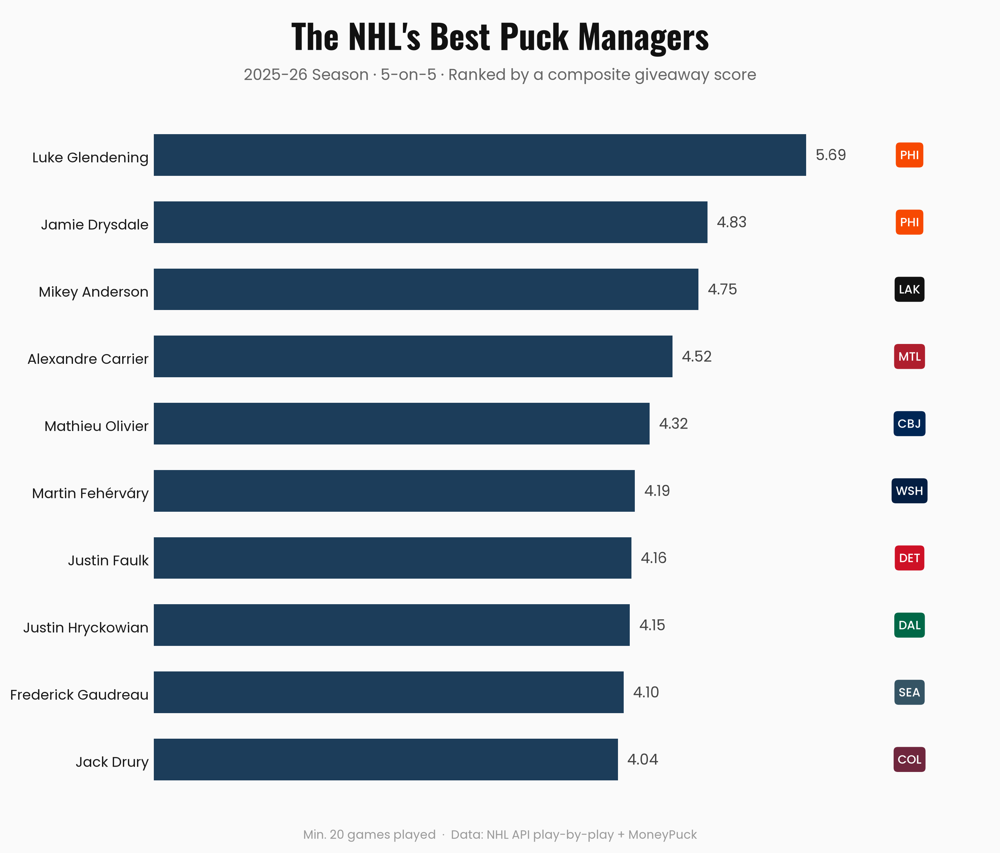

# NHL Puck Management

A composite metric for evaluating 5-on-5 puck management among NHL skaters, built from full-season play-by-play data. Combines giveaway frequency, giveaway danger relative to expectation, and defensive-zone giveaway rate into a single, position-adjusted score.



## What this measures

"Puck management" here specifically means **turnover reliability**: how often a player loses the puck, and how costly those turnovers tend to be. It is not a measure of overall offensive value or skill; a conservative, low-risk player will naturally score well here even if a higher-usage offensive star creates more total value elsewhere. See [Key Findings](#key-findings) below for why that distinction matters.

## Methodology

### Data
- **NHL API play-by-play**: full 2025-26 regular season, pulled and flattened via `src/data/fetch.py` and `src/data/process.py`
- **MoneyPuck**: 5-on-5 skater season stats (ice time, zone starts, shift counts)

### Model 1: xGoal (shot danger)
Logistic regression predicting goal probability from shot distance and angle. Trained on Fenwick shots only (shots on goal, missed shots, goals); blocked shots are excluded from training because the NHL API records blocked-shot coordinates at the blocker's position, not the shooter's release point. Applied afterward to all shots, including blocked ones.

### Danger Score
For each 5-on-5 giveaway, the sum of opposing Fenwick shot xGoals within a 15-second, stoppage-aware window following the turnover.

### Model 2: Expected Danger
Random Forest regressor predicting a giveaway's expected danger from its distance and angle to the giving team's own net (not simply the nearest net; see notes below). Evaluated via 5-fold out-of-fold cross-validation against several baselines (league mean, zone average, linear regression). `above_expected = expected_danger - danger_score`; positive means a giveaway was less costly than its situation predicted.

### Composite Score
Three metrics, each z-scored (median absolute deviation, not standard deviation, more resistant to the outliers common in this data) separately for forwards and defensemen, confidence-weighted by sample size, then summed:

1. **Giveaway rate per 60** (lower is better)
2. **Giveaway danger above expected** (higher is better)
3. **Defensive-zone giveaway rate**, normalized by defensive-zone shift starts (lower is better)

Players with under 20 games played are excluded. Confidence weighting pulls low-sample players toward their positional median rather than dropping them outright, weighted separately for overall ice time (Metrics 1–2) and defensive-zone shift starts specifically (Metric 3), since a player can have heavy ice time overall while rarely being deployed defensively.

## Key findings

- The top of the rankings is dominated by reliable depth players (Luke Glendening, Jamie Drysdale), not offensive stars. This is expected, not a flaw: even after normalizing for usage, high-event offensive players (MacKinnon, Malkin, Hughes) give the puck away more often per opportunity, likely a byproduct of taking on more offensive risk and responsibility. This metric rewards reliability, not offensive skill.
- A giveaway's *location* explains whether it becomes dangerous far better than it explains *how* dangerous. Model 2's features predict "did anything happen" (AUC 0.65) much better than "how bad was it" (a tested two-stage hurdle model performed no better than the single Random Forest).
- Player deployment can distort simple rate-based metrics in non-obvious ways: see the write-up for a specific case where a player's defensive-zone giveaway rate was misleading due to a numerator/denominator mismatch, and how it was corrected.

## Repo structure

```
data/
├── raw/                    # unprocessed NHL API pulls
└── processed/               # events.csv, skaters.csv, player_giveaways.csv, final_rankings.csv
notebooks/
├── 01_eda_methodology.ipynb
├── 02_modeling.ipynb        # Model 1 (xGoal) + Model 2 (expected danger)
├── 03_scoring.ipynb         # composite score pipeline
└── 04_visualizations.ipynb
outputs/                     # exported chart images
src/
└── data/
    ├── fetch.py              # pulls play-by-play from the NHL API
    └── process.py            # flattens raw JSON into events.csv
```

## Running this yourself

```bash
conda env create -f environment.yml
conda activate nhl-puck-mgmt
```

Run the notebooks in order (`01` through `04`). `fetch.py` requires no API key but respects NHL API rate limits and is resumable if interrupted.

## Data sources

- [NHL API](https://api-web.nhle.com): play-by-play event data
- [MoneyPuck](https://moneypuck.com): season-level skater statistics

## Acknowledgments

Much of the code and writing for this project, including the modeling, scoring pipeline, visualizations, and parts of the accompanying write-up, was developed with the assistance of Claude AI.

## License

See [LICENSE](LICENSE).
